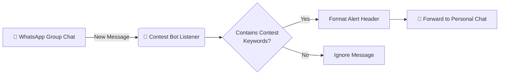

# 📢 WhatsApp Contest Alert & Message Forward Bot

<p align="center">
  
  
  
  
</p>

<p align="center">
  <b>Never miss a competitive programming contest or critical update again.</b><br>
  An automated, real-time WhatsApp bot that monitors designated groups for contest announcements (Codeforces, LeetCode, AtCoder, CodeChef, etc.) and instantly forwards formatted alerts to your personal DM.
</p>

---

## 🌟 Features

- ⚡ **Real-Time Event Driven**: Listens for new messages instantly via WhatsApp Web socket events—zero polling overhead.
- 🎯 **Smart Keyword Detection**: Scans incoming messages against configurable keywords (`codeforces`, `leetcode`, `atcoder`, `div`, `round`, etc.).
- 💬 **Instant Direct Forwarding**: Prepends a clean `📢 *Contest Alert!*` header and delivers the original message straight to your personal chat.
- 🔐 **Privacy-First & Local Auth**: Runs entirely on your local machine or private server using `LocalAuth` session caching. No third-party servers or external cloud brokers touch your messages.
- 🐳 **Docker Support**: Ready to be packaged and run in headless container environments.

---

## 🏗️ How It Works



---

## 📋 Prerequisites

Before running the bot, ensure you have:

- **[Node.js](https://nodejs.org/)** (v18.x or v20.x recommended)
- **npm** (comes bundled with Node.js)
- A mobile phone with an active **WhatsApp** account and camera for QR scanning
- Google Chrome or Chromium installed (required by Puppeteer for WhatsApp Web automation)

---

## 🚀 Quick Start Guide

### 1. Clone the Repository

```bash
git clone https://github.com/djcode0718/Whatsapp-coding-contest-alerter.git
cd Whatsapp-coding-contest-alerter
```

### 2. Install Dependencies

```bash
npm install
```

### 3. Configure Target Group & Contact

Open [`contest-bot.js`](./contest-bot.js) in your text editor and update the constants:

```javascript
// Replace with the exact name of the group you want to monitor
const GROUP_NAME = "Your College / Coding WhatsApp Group";

// Replace with your exact WhatsApp contact name or DM name
const YOUR_NAME = "Your Contact Name";
```

> 💡 **Tip**: The names must match the exact display names as they appear in your WhatsApp chat list (case-sensitive).

### 4. Start the Bot

```bash
node contest-bot.js
```

### 5. Link Your WhatsApp Account

- A QR code will be generated right inside your terminal.
- Open **WhatsApp** on your phone > **Settings** (or 3 dots menu) > **Linked Devices** > **Link a Device**.
- Scan the QR code displayed in the terminal.
- Once authenticated, your session is saved locally in `.wwebjs_auth/` so you won't need to scan it every time!

---

## ⚙️ Configuration & Customization

### Adding / Editing Keywords

You can easily extend or tweak the monitored keywords in [`contest-bot.js`](./contest-bot.js#L10):

```javascript
const KEYWORDS = [
    "contest",
    "codeforces",
    "cf",
    "atcoder",
    "div",
    "round",
    "leetcode",
    "weekly",
    "biweekly",
    "codechef",
    "hackerrank",
    "kickstart",
    "questions",
    "question",
    "coding"
];
```

### Customizing Alert Message Format

Modify the forwarded message template in [`contest-bot.js`](./contest-bot.js#L53):

```javascript
await personalChat.sendMessage(`📢 *Contest Alert!*\n\n${msg.body}`);
```

---

## 🐳 Running with Docker

You can build and run the bot in a Docker container for 24/7 background operation:

### 1. Build the Docker Image

```bash
docker build -t whatsapp-contest-bot .
```

### 2. Run the Container

```bash
docker run -it --name contest-bot \
  -v $(pwd)/.wwebjs_auth:/app/.wwebjs_auth \
  whatsapp-contest-bot
```

> 📌 **Note**: Mount the `.wwebjs_auth` directory so session tokens persist across container restarts.

---

## 📂 Project Structure

```
whatsapp-msg-forward-bot/
├── contest-bot.js       # Main bot logic, event listeners & keyword filtering
├── Dockerfile           # Docker container configuration
├── package.json         # Project metadata and dependencies
├── .wwebjs_auth/        # Saved WhatsApp Web session (auto-generated, gitignored)
├── .wwebjs_cache/       # WhatsApp Web cache files (auto-generated, gitignored)
└── README.md            # Project documentation
```

---

## 🛠️ Troubleshooting & FAQ

<details>
<summary><b>❓ "Group '<GROUP_NAME>' not found" or "Chat with '<YOUR_NAME>' not found"</b></summary>
<br>

- Ensure that the group and contact names in `contest-bot.js` **identically match** the names shown in WhatsApp (including emojis and special symbols).
- Verify that your WhatsApp account has at least one prior message exchange with that contact/group so it appears in your active chat list.
</details>

<details>
<summary><b>❓ QR code does not render properly in terminal</b></summary>
<br>

- Ensure your terminal window is sufficiently wide to render the QR block cleanly without word wrapping.
- Alternatively, use a terminal with UTF-8 / ANSI color support (e.g., iTerm2, VS Code Integrated Terminal, Windows Terminal).
</details>

<details>
<summary><b>❓ How do I log out or reset the session?</b></summary>
<br>

- Delete the `.wwebjs_auth` folder in the root directory and restart the script:
  ```bash
  rm -rf .wwebjs_auth .wwebjs_cache
  node contest-bot.js
  ```
</details>

---

## 🤝 Contributing

Contributions, issues, and feature requests are welcome!
Feel free to check the [issues page](https://github.com/djcode0718/Whatsapp-coding-contest-alerter/issues) if you want to contribute.

1. Fork the Project
2. Create your Feature Branch (`git checkout -b feature/AmazingFeature`)
3. Commit your Changes (`git commit -m 'Add some AmazingFeature'`)
4. Push to the Branch (`git push origin feature/AmazingFeature`)
5. Open a Pull Request

---

## 📄 License

This project is open-source and available under the [MIT License](LICENSE).
